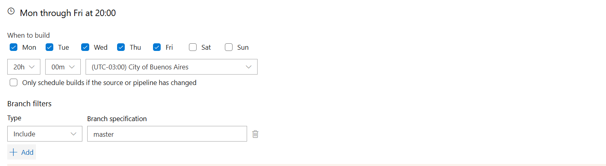

# Automation pipeline: Shut down an Ec2 instance
This repository features an Azure Pipeline designed to automate the process of shut down an EC2 instance in AWS. Includes a command to shut down EC2. This configuration optimizes infrastructure management, reduces manual work, and ensures that instances are properly shut down.

### 🛠️For the use the schema
* Azure devOps account
* * Create new pipeline
* * Add variables in the pipeline
```
AWS_ACCOUNT_ACCESS_KEY_ID
AWS_ACCOUNT_SECRET_ACCESS_KEY
AWS_EC2_INSTANCE_ID
AWS_EC2_REGION
```
* Aws account
* * EC2
* * RDS

### ⚡Triggers in Azure Devops
We can configure pipelines to run on the days we need:
- Create pipeline in Azure Devops
- Setting pipeline with this repository and azure-pipelines.yml
- Select Triggers and Scheduled
- Scheduled detail:

<div align="center">
  
</div>
